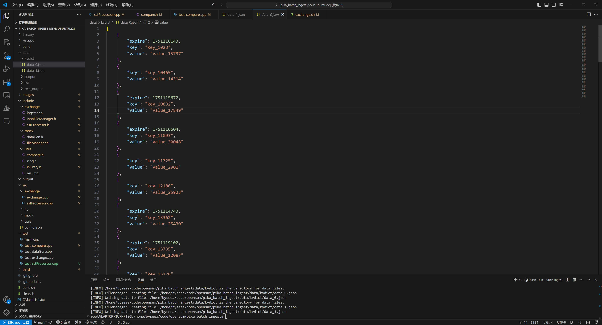
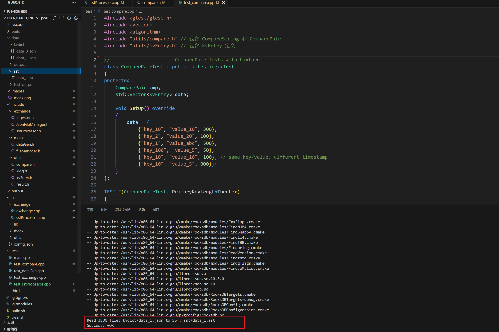

# pika_batch_ingest

## Introduction
场景：一个用户有 30GB 的数据需要写入 Pika。之前只能通过 Redis 命令逐条写入（如 `SET key value`）。通过这个项目，客户端可以先根据规则将这 30GB 数据生成 SST 文件，然后将这些文件注入到 Pika 的 RocksDB 中。对于模拟数据，暂时只需要覆盖 **String** 类型即可。

## Todo List
- [ ] 生成 SST 文件并实现主从复制
  - [x] 模拟数据，覆盖 String 类型
  - [x] 生成 SST 文件
    - [ ] 需要实现多线程生成
    - [ ] 需要实现自动扫描文件目录
    - [ ] 需要实现生成的sst文件读取工具
  - [ ] 文件导入到Pika
  - [ ] 上传到共享存储并通知 Pika 服务端
  - [ ] 在 Pika 服务端实现主从复制
- [ ] 自动化：实现自动化流程
  - [x] Mock自动化
  - [x] Exchange自动化
- [ ] 测试：编写相关测试，确保功能的正确性
  - [x] Mock单元测试
  - [x] Exchange单元测试

## Usage

```shell
../../build.sh
cd ../../output && ./pika_batch_ingest
```

## 各组件实现

### mock
用于生成模拟数据文件。使用方式如下：

```bash
./mock.sh -n {size} -d {dict}
```
示例（生成大小为 10GB，生成数据放在kvdict文件夹下）：
```bash
./mock.sh -n 10G -d "kvdict"
```
-n: 指定生成文件的大小，例如 10G, 500M 等；
-d: 指定生成数据的目录，用于存放生成内容；

实现效果如下


### exchange

注意使用的rocksdb是动态库，需要添加一下动态库的系统变量

```shell
 export LD_LIBRARY_PATH=/home/byseea/code/opensum/pika_batch_ingest/third/rocksdb:$LD_LIBRARY_PATH
 ```

用于将模拟数据文件转化为sst文件。使用方式如下：

```bash
./exchange -k {kv} -s {sst}
```
示例（kv数据是放在kvdict文件夹下的data_1.json，生成的sst数据是放在sst文件夹下的data_1.sst）：
```bash
./exchange -k "kvdict/data_1.json" -s "sst/data_1.sst"
```
-k: 指定kv数据的文件；
-s: 指定sst数据的文件；

实现效果如下
